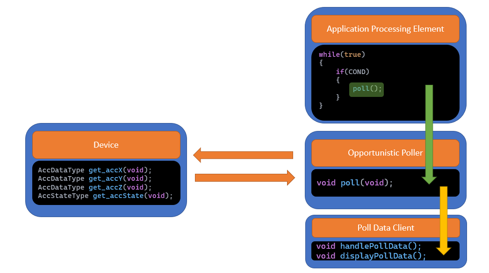
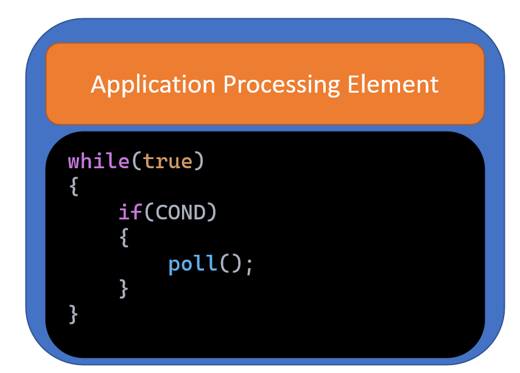
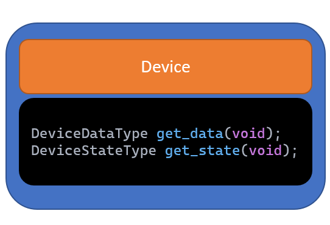
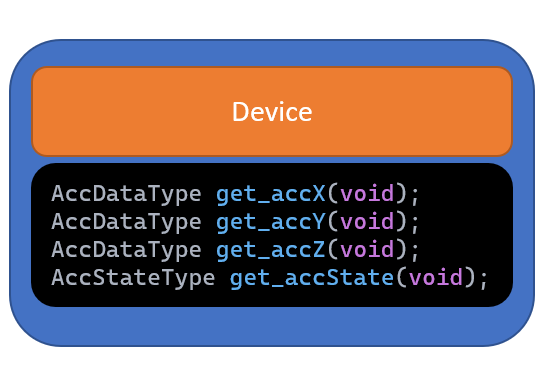
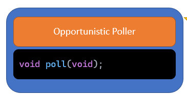
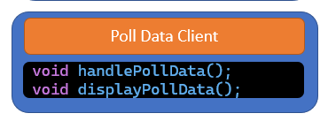
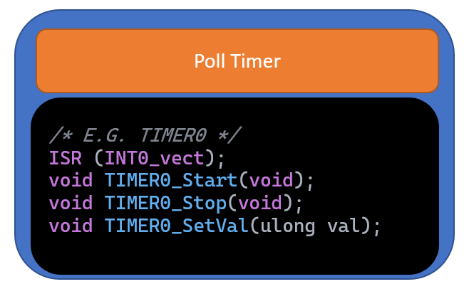
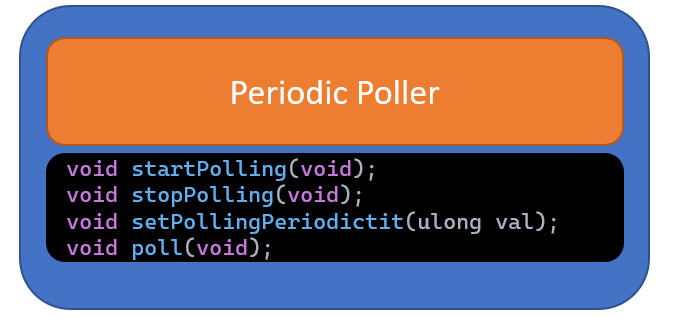

# Lecture 10 - Polling Pattern

- [1. Polling Pattern](#1-polling-pattern)
- [2. When to Use?](#2-when-to-use)
- [3. SPI Example](#3-spi-example)
    - [3.1. Periodic Polling Approach](#31-periodic-polling-approach)
    - [3.2. Opportunistic Polling Approach](#32-opportunistic-polling-approach)
    - [3.3. Modified Periodic Polling Approach](#33-modified-periodic-polling-approach)
- [4. Opportunistic Polling Structure](#4-opportunistic-polling-structure)
    - [4.1. Application Processing Element](#41-application-processing-element)
    - [4.2. Device](#42-device)
    - [4.3. Opportunistic Poller](#43-opportunistic-poller)
    - [4.4. Poll Data Client](#44-poll-data-client)
- [5. Opportunistic Polling Example](#5-opportunistic-polling-example)
- [6. Periodic Pooling](#6-periodic-pooling)
    - [6.1. Poll Timer](#61-poll-timer)
    - [6.2. Periodic Poller](#62-periodic-poller)

### 1. Polling Pattern

* Polling pattern is the most common way to check and retrieve new data from the hardware by calling a fucntion called the **poller** or the **getter**.

* Polling can be periodic or opportunistic.

* The periodic polling use a timer ISR, OS task, software timer to tell when to call the getter.

* The opportunistic poller calls the getter function when a set of conditions are satisfied.

* An example of the periodic polling is calling the getter from the temperature sensor periodically after ISR triggered from Timer 1 every 5 ms.

* An example of the opportunistic polling is calling the getter function of the ultrasonic sensor to get the distance between the gate and an employee **only if** a password that was just entered is correct.

### 2. When to Use?

**Periodic Polling** 

***Pros:*** Good response time
***Cons:*** Huge effect on the CPU load. (Overhead) due to always beind called and executed

**Opportunistic Polling** 

***Pros:*** Smaller effect on the CPU load as it's only called when set of conditions is met.
***Cons:*** Worse response time due to time taken to check the conditions.


### 3. SPI Example

SPI is a high-rate synchronus protocol. Let's say it takes $1 \mu s$ for each byte to be transferred. We want to design a polling pattern to extract the data transfered from the SPI protocol.

#### 3.1. Periodic Polling Approach

* Desiging the pattern as a periodic polling means that we will select a timer and set it's ISR trigger peroid for $1 \mu s$ and when the ISR is triggered, we call the poller.

* This is unreasonable approach as $1 \mu s$ is very small peroid that would cause a great load on the CPU to call the poller every period.


#### 3.2. Opportunistic Polling Approach

* A better approach is to the design the pattern as opportunistic polling by checking the value of the SPI transfer finished flag for each byte. Again, we need to set a period to check the flag and to take the worst case scenario we will set the period to $1 \mu s$.

* Such a small period will still cause a huge CPU load. In such cases when working with a high-rate SPI, a FIFO (First-In-First-Out) external memory is coupled with the SPI, so that when collection a set number of bytes (say 100 bytes), a ISR (flag) will be triggered and we can check this flag instead of the SPI flag as now the worst case scenario will be 10 ms instead of 1 $\mu$ s.

#### 3.3. Modified Periodic Polling Approach

* Now, after adding the FIFO memory, we can set the periodicity of calling the poller function to be 10 ms instead of 1 $\mu$ s.


### 4. Opportunistic Polling Structure




#### 4.1. Application Processing Element



This component has the function that checks a set of conditions if they were met, a `poll()` function will be invoked.

#### 4.2. Device



This component provides the data and/or the state of device (OPERATION / ERROR / STANDBY) via public functions (interfaces).

For example, the accelometer measures the acceleration in 3 directions; x, y, and z. Before starting the work, a **self-test** is performed to check the SPI connection with the acceleometer. When checked, a pin in the internal registers of the accelerometer is set and being accessed as the state of the device. That's why if you used it as the device, you may find the device component has the following functions.




#### 4.3. Opportunistic Poller

This component has the `poll()` function that scans attached devices and sensors for data and device states and passes each to the polled data client responsible for




For example, a opportunstic poller is being called by the application processing element after checking for some conditions and actions. The poller will retrieve the current temperature and then pass it to an LCD to display it.

Usually, the `poll()` function is `void` because it's **asynchronus** which results that the data or the state of the deivce are stored in shared location between the different components.

#### 4.4. Poll Data Client

This is the component that takes the data or the state of the device from the shared lcoations manipulate by the `poll()` function. And apply some actions using this data either manipulating them further or displaying them like the LCD.




### 5. Opportunistic Polling Example

We have a push button that we are required to turn on a LED based on the state of the button only if a set of conditions c1, c2 are met.

```c
/* ApplicationProcessingElement.c */
while(true)
{
    if(c1 && c2)
    {
        poll();
    }

}
```

```c
/* OppPoller.c */
void poll(void)
{
    bState = Button_readState();
    LED_activatte();
}
```

```c
/* Button.c ==> DEVICE */ 
ButtonState Button_readState(void);
```

```c
/* LED.c ==> POLL DATA CLIENT */
void LED_activate(void)
{
    if(bState = PRESSED)
    {
        LED_turnON();
    }
    else
    {
        LED_turnOFF();
    }
}
```


### 6. Periodic Pooling

#### 6.1. Poll Timer

The poll timer element may represent a timer ISR, software timer, or OS (Operating System) task with periodicity.

This component usually have different functions regarding the start, stop and periodicity of the poll timer;

* `startTimer()`
* `handleInterrupt()` == **ISR**
* `stopTimer()`
* `setTimerPeriod()`

The following is an example of a poll timer using Timer0.



Once the timer starts counting, the ISR will be invoked when every period assigned to the periodicity and the ISR will call the `poll()` function.

#### 6.2. Periodic Poller




It includes function that is responsible for:

* Starting the pooling, thus, starting the reading procedure `startPolling()`. This is done by setting a flag let's call it for example `pool_state` which is checked before calling the functions from the device component.

* Ending the pooling thus ending the reading procedure `stopPolling()`. This is done by clearing the `pool_state`.

* `poll()` which calls the functions from the device component.

* Other functions that call the APIs from the poll data client to handle, manipulate, or display the data from the shared locations set by the `poll()` function.

**The device and poll data client components are the same from the opportunistic poliing structure.**