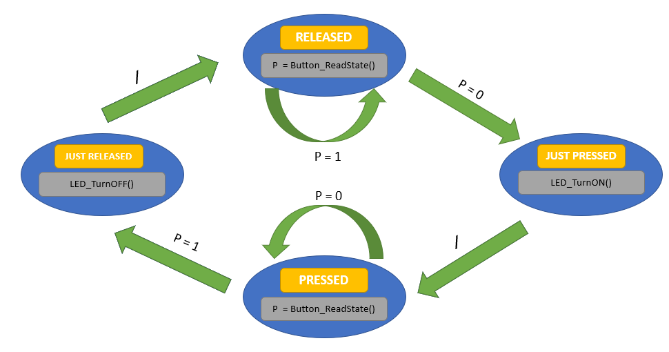
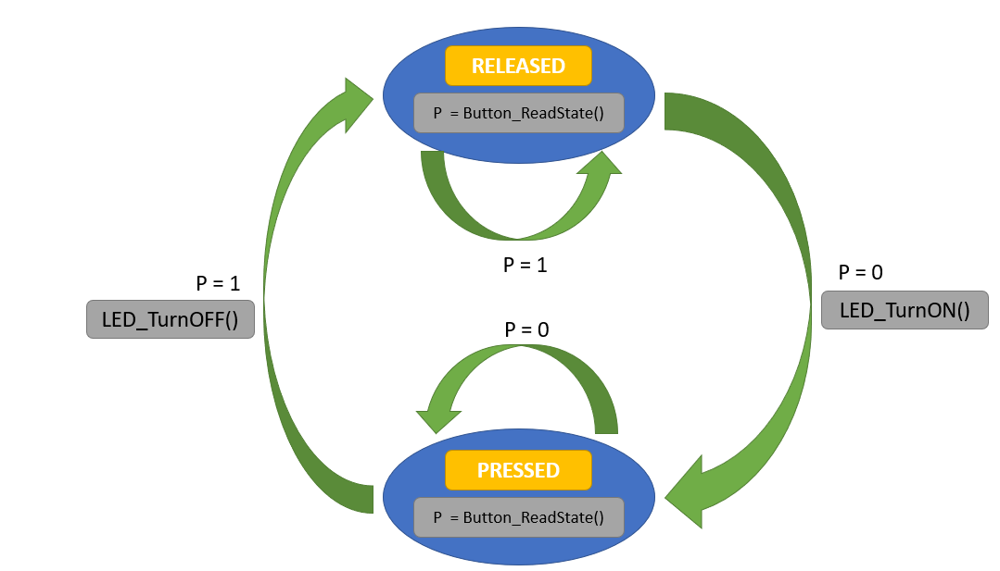

# Lecture 11 - Observer Pattern and Finite State Machine Pattern

- [1. Observer Pattern](#1-observer-pattern)
- [2. Observer Pattern Structure](#2-observer-pattern-structure)
  - [2.1. AbstractSubject](#21-abstractsubject)
  - [2.2. AbstractClient](#22-abstractclient)
- [3. Observer Pattern Example](#3-observer-pattern-example)
  - [3.1. AbstractClient](#31-abstractclient)
  - [3.2. AbstractSubject](#32-abstractsubject)
- [4. Finite State Machine Pattern](#4-finite-state-machine-pattern)
- [5. Push Button FSM Example](#5-push-button-fsm-example)
  - [5.1. 4-state FSM](#51-4-state-fsm)
  - [5.2. 2-state FSM](#52-2-state-fsm)
- [6. Transition Table](#6-transition-table)

### 1. Observer Pattern

* The observer **observes** a specific **one** event (or a number of replicas of the event) and **notify** clients associated with a replica of the event.

* The observer (or the event manager) doesn't require to know anything about the clients.

* The clients provide a callback function that is called when the event occurs. The client sends a pointer to the callback function through a function provided by the observer called `subscribe()`. 

* And they can tell the observer to not notifty them if the event occurs using the `unsubscribe()` function.

### 2. Observer Pattern Structure

#### 2.1. AbstractSubject

* It's the observer, server, or scheduler that maintain a list of the interested subscribers.

* It also has a `notify()` function that executes the proper callback function based on which replica of the event occured.

#### 2.2. AbstractClient

It's the client that adds itself into the subscribers (notifications) list throught the `subscribe()` function from the AbstractSubject component.

### 3. Observer Pattern Example

We have 2 buttons. One for incrementing a variable and the other for decrementing. An LCD is supposed to show the current value of that variable.


#### 3.1. AbstractClient

```c
/* CounterClient.c */
void IncrementButtonPressed(void)
{
    Counter ++;
}

void DecrementButtonPressed(void)
{
    Counter --;
}

int main(void)
{
    Scheduler_Subscripe(&IncrementButtonSubscribe, 1); 
    // You can discard the &, it's exactly the same 
    Scheduler_Subscripe(&DecrementButtonSubscribe, 2);
    while(1)
    {
        Display(Counter);
    }
}
```

#### 3.2. AbstractSubject

```c
/* Btn_Mgr.c */
void Scheduler_Subscribe(CallBackPtr callback, int id)
{
    Scheduler_CallBacks[id] = callback;
}

void Btn_MgrAPI(void)
{
    Btn_UpdateStates();
    for(int i = 0; i < NUM_BUTTONS; i++)
    {
        if(isPressed[i] == PRESSED)
        {
            Scheduler_Callbacks[i]();
        }
    }
}
```


### 4. Finite State Machine Pattern

* It's a directed **graph** composed of three elements: *states*, *transitions*, and *actions*.

* **State** is a condition of the system. E.g., ON, OFF, OPERATING, ERROR, PAUSE, etc.

* Usually, there are some functions that are executed during this state. For example, if a state includes an increment operation exists in a state, every time the system is in this particular state, the increment will be executed as long as the system is in this state.

* **Transition** is the path that transits the system from one state to another.

* The transition usually occurs when an event is triggered or a condition is met. If so, the action, or the condition, is written on the path of the transition. Otherwise, a **/** is written indicating the transition will occur anyway when the preceeding state finishes its functions.

* **Actions** are the functions that are executed in the system, they can be executed:
  * As long as they are in a state.
  * When the system enters a state.
  * When the system exits a state.


### 5. Push Button FSM Example

**NOTE**: The push button is active low.

#### 5.1. 4-state FSM



#### 5.2. 2-state FSM





### 6. Transition Table

It's a table whose rows are the current state of the system and the columns are the conditions or actions occured to transit into another state. The values of the cells are the next states.

For example, the following is a transition table of a microwave

|             | INITIAL | PowerTurnedON | CookRequested | DoorIsOpen | DoorIsClosed | CancelRequested | PauseRequested | ResumeRequested | NULL (No Action or Condition Required) |
|:-----------:|:-------:|:-------------:|:--------------------:|:----------:|:------------:|:---------------:|:--------------:|:---------------:|:--------------------------------------:|
|     ROOT    |   OFF   |               |                      |            |              |                 |                |                 |                                        |
|     OFF     |         |     READY     |                      |            |              |                 |                |                 |                                        |
|    READY    |         |               |      MICROWAVING     |  DOOROPEN  |              |                 |                |                 |                                        |
| MICROWAVING |         |               |                      |  DOOROPEN  |              |      READY      |     PAUSED     |                 |                  READY                 |
|   DOOROPEN  |         |               |                      |            |  MICROWAVING |      READY      |                |                 |                                        |
|    PAUSED   |         |               |                      |  DOOROPEN  |              |      READY      |                |   MICROWAVING   |                                        |
