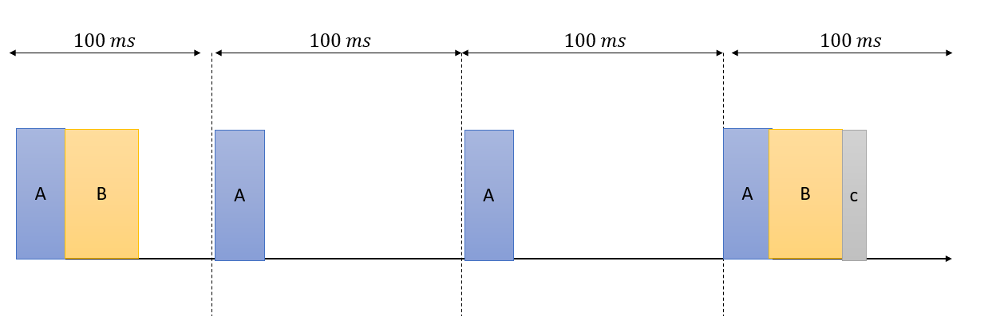
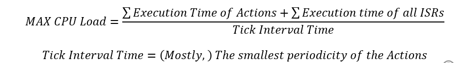
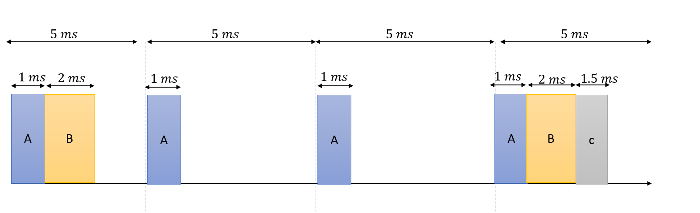
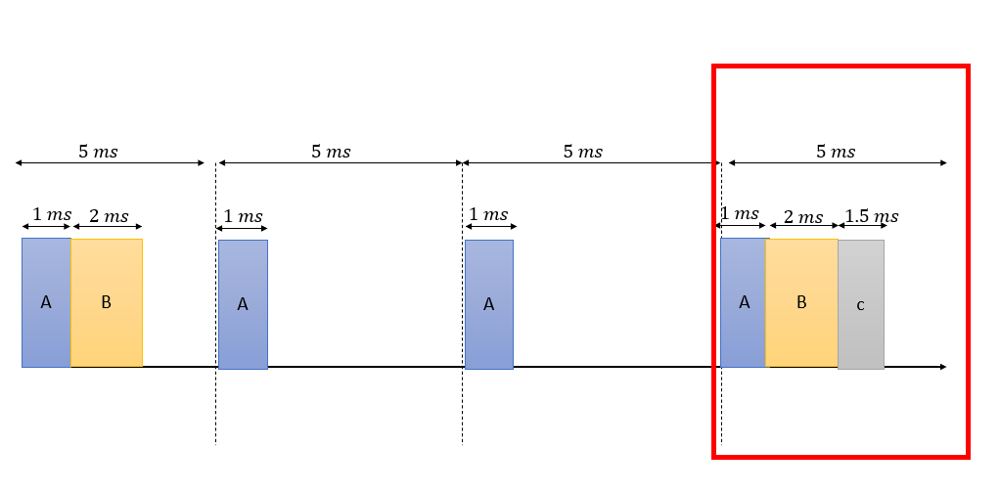
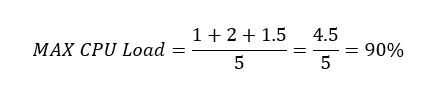
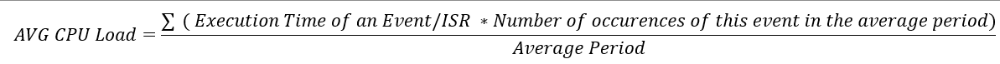
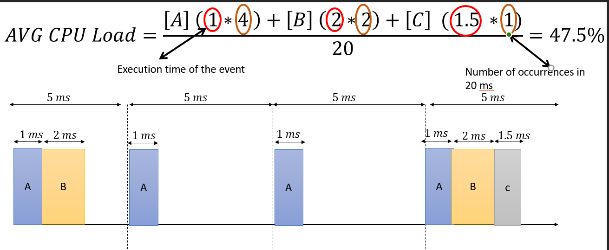

# Lecture 12 - Handling Real Time Constrains

- [0. Real Time System](#0-real-time-system)
- [1. Response Time](#1-response-time)
- [2. Interval](#2-interval)
- [3. Periodicity](#3-periodicity)
- [4. Jitter](#4-jitter)
- [5. CPU Load](#5-cpu-load)
- [6. Max CPU Load](#6-max-cpu-load)
- [7. Average CPU Load](#7-average-cpu-load)


### 0. Real Time System

It's a system that we ensure it'll always satisify some constrains (mostly timing constrains).

### 1. Response Time

It's the timer between when a request is initiated by a client and a response is recieved by that client. For example, if a user pressed on a button and a LED is turned ON after **200 ms**, the response time is the **200 ms**.


```c
if(Button_ReadState() == PRESSED) /* REQUEST */
{
    Action1(); /* 50 ms */
    Action2(); /* 50 ms */
    LED_TurnON(); /* RESPONSE 100ms */ 
}
```

What may affect the response time ?

1. The execution time of the response action itself. (The more reposne execution time, the more response time)


2. The execution time of the actions before the response action. (The more execution time of the preceeding actions, the more response time)

3. Clock frequency, when it increases, the response time is smaller as the actions will require less time for the same number of clocks. However, there is a trade-off between the clock frequency and power consumption.

4. The design structure used to implement the request-response system.

### 2. Interval

Interval is the minimum time that must be passed between 2 actions. For example, after turning on LCD, no commands should be sent to the LCD before a period of **15 ms** after switching the power. The interval here is **15 ms**.

**Usually, the interval and the response time contradict each other.**

### 3. Periodicity

The time every which a periodic action is called. For example an ISR of TIMER0 may have a periodicity of **100 ms**.

### 4. Jitter

For a periodic action, jitter is the maximum deviation allowable for the periodictiy of that action. For example, it's OK to have a periodic function that has a periodicity of **100 ms** to be executed at **101 ms** if a jitter of **1 ms** is allowable.

### 5. CPU Load 

**Summarized from the original lecture and extra video, no worries**


CPU Load is defined as the percentage of the CPU that is busy with execution a set of instructions. Usually our concern with the CPU load is when dealing with periodic actions and ISRs.

For example, we have 3 actions: **A, B, C**. A has a periodictity of 100 ms, B has a periodicity of 200 ms, and C has a periodicity of 400 ms.

**Note: these actions may be separate actions that are executed in a single perodic action with some control using some conditions, or three separate periodic actions each have a prirority A > B > C.**

```c
char i = 1;

void ISR_100(void)
{
    A();
    if(i % 2 == 0)
    {
        B();
    }
    else if(i % 4 == 0)
    {
        C();
        i = 1;
    }
    i += 1;
}

```

which will result in the following timing diagram,



Here we will notice the following:

* A will not in any case violate a jitter constraint because it is always called every 100 ms.

* The jitter of B will depend on the execution time of A, if the execution time of A is greater than a set jitter, the constraint will be violated.

* The jitter of C will depend on the execution time of A and B, if the execution time of A+B is greater than a set jitter, the constraint will be violated. **What can we do?**
  * Change the position of C in the code. Either swap it with A or B.
  * Try to optimize the execution of A or B or both.


**Why do we care for a low CPU Load ?** To avoid full CPU due to non-determinstic ISRs.

### 6. Max CPU Load

The max CPU load occurs at **worst case scenario**. So, look for the period where the CPU is mostly busy and calculate the Max cpu load using the following equation.



For example, we have the following actions,

| Action | Offset | Periodicity | Execution Time |
|:------:|:------:|:-----------:|:--------------:|
|    A   |    0   |      5      |        1       |
|    B   |    0   |      10     |        2       |
|    C   |    0   |      20     |       1.5      |

will result in the following timing diagram,





So, to calculate the max CPU load, look at the worst case scenario which is,




which will result in




### 7. Average CPU Load

The average CPU load deals with the average case, this occurs every average period, in which every event at least occured once, called system hyper visor, which is the smallest common multiplier. 

For example, we have three actions of A, B, C, have periodicties of

* 100, 200, 400 ==> Average Period = 400.
* 5, 10, 15 ==> Average Period = 15.
* 2, 3, 6 ==> Average Period = 6.
* 2, 3, 7 ==> Average Period = 2 * 3 * 7 = 42.


We can get the average CPU load using the following equation,




in our example, the average period is 20 ms, then we can get the average CPU load as 



