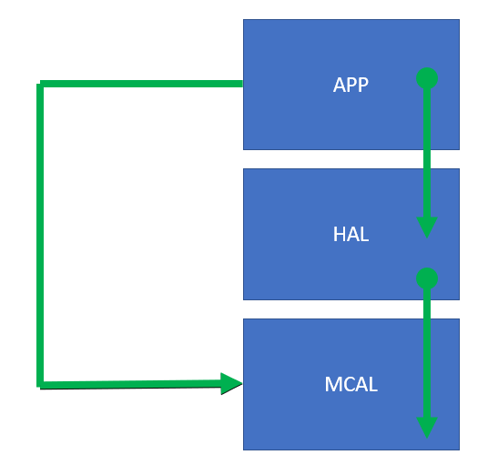

# Lecture 8 - Layered Architecture

- [1. Design Patterns](#1-design-patterns)
- [2. Layered Architecutre](#2-layered-architecutre)
- [3. Micro Controller Abstract Layer (MCAL)](#3-micro-controller-abstract-layer-mcal)
- [4. Hardware Abstract Layer (HAL)](#4-hardware-abstract-layer-hal)
- [5. Application Layer](#5-application-layer)
- [6. Types of Layered Architecture](#6-types-of-layered-architecture)
  - [6.1. Closed-Layer Approach](#61-closed-layer-approach)
  - [6.2. Open-Layer Approach](#62-open-layer-approach)
- [7. Sinkhole Anti-Pattern](#7-sinkhole-anti-pattern)
- [8. Layered Architecture Pattern Analysis](#8-layered-architecture-pattern-analysis)
  - [8.1. Overall Agility (Flexibility) LOW](#81-overall-agility-flexibility-low)
  - [8.2. Testability HIGH](#82-testability-high)
  - [8.3. Perfomrance LOW](#83-perfomrance-low)
  - [8.4.Ease of Development HIGH](#84ease-of-development-high)

### 1. Design Patterns

A design pattern is a standard way of solving a specific common type of problems. One pattern is the layered architecture or the n-tier(layer) architecture.

### 2. Layered Architecutre

* The most common and popular architecture used. It's about creating layers in which each layer is repsonsible for the software (code) of specific type of components of the system. 

* Each layer contains a driver for each components assigned to the layer. Each driver contains services (interfaces) that the upper layers use to build the logic of their drivers and software.

* Each layer provides an abstraction from the other layers, i.e., a layer just use a service from a lower layer without taking into consideration the mechanism of manipulating the peripherals to make this request or service as this is the job of the lower layer.

* The most common and basic layered architecture is the 3-tier architecture which consists of 3 layers; **Micro Controller Abstract Layer (MCAL)**, **Hardware Abstract Layer (HAL)**, and **Application Layer(AL)**.

### 3. Micro Controller Abstract Layer (MCAL)

It's the layer that is responsible for the software of the peripherals of the microcontroller. It includes the drivers of **DIO (*D*igital *I*nput *O*utput** , **PWM**, **ADC**, **SPI**, **UART**.

### 4. Hardware Abstract Layer (HAL)

* It's the layer that is responsible for the software (code) of the hardware components, sensors, and actuators such as the drivers of **LCD**, **buttons**, **LED**, **a heating coil**, **a temperature sensor**, **an external EEPROM**.

* It uses interfaces (services) from the **MCAL** layer without taking into account how does the request sent from the **HAL** to the **MCAL** manipulates the peripherals or what actions are taken down there to generate the response asked by the **HAL** layer request.

* For example, the button driver contains services `Button_init()` which calls other services from the DIO driver in the MCAL such as `DIO_write()` and `DIO_setDirection()`.

* If we want to change the sensor to another one (that does the same services), in most cases, the driver of that sensor will be replaced without changing (or changing with minimal changes) any driver from the application or the MCAL layer.

### 5. Application Layer

* It contains the drivers responsible for the logic of the whole project or task. calls services from the lower layers.

* For example, a porject's application layer may contain
  *  an input handler that uses services from the button driver in the HAL for reading the state of a button and based on it, it makes different actions.
  *  a temperature handler that uses services from the temperature driver in the HAL layer for getting the value of the temperature and if it is lower than a set threshold, it will call a service from the coil driver to activate the coil.
  *  a display handler that uses services from the LCD driver from the HAL.

### 6. Types of Layered Architecture

#### 6.1. Closed-Layer Approach

* An approach in which a request from a layer requires moving through layer just below to get to another layer.

* i.e., a service from the application layer can't call a service from the MCAL which is 2 layers lower than it. Instead, the service of the application layer must call a service from the HAL layer that calls the originally required service from the MCAL layer.

* This is the better approach in most cases.

*  Pros: 
  *  better modularity and portability.
  
*  Cons: 
  * timing problems from calling services that call services that call services and so on.
  * resources and memory problems.

#### 6.2. Open-Layer Approach

* Contractidly, the upper layer can call a service from any lower layer even if it is not the just next layer.

*  Pros: 
  *  better timing.
  
*  Cons: 
  * harder portability and reusability.

### 7. Sinkhole Anti-Pattern

* It's a technique used to determine which approach should we follow for the layers whether to make them open or closed.

* Based on the services of the layer, if a service calls a service calls a service in which the intermediate services has little logic or no logic at all. The service falls in what is called a sinkhole in which time is wasted to execute a minimal logic where we could have called the last serivce directly.

* If the majority (in other refernces use the 20% percent threshold) of the services of the layer may fall in the sinkhole anti-pattern, make this layer open. Otherwise, make it closed.

### 8. Layered Architecture Pattern Analysis

#### 8.1. Overall Agility (Flexibility) LOW
It requires a huge time and effort to provide a global generality for a layer besides the proper isolation. This is due the coupling of components found within the pattern.

#### 8.2. Testability HIGH
As components belong to specific layers, other layers can be easily mocked or stubbed easily (mocking and stubbing are tools of unit testing). This means that testing is performed much easier.

#### 8.3. Perfomrance LOW
It's difficult to get a high performance specially the timing part because of the coupling between the components.

#### 8.4.Ease of Development HIGH
It's not too complex to develop or implement a project using this type of design patterns.